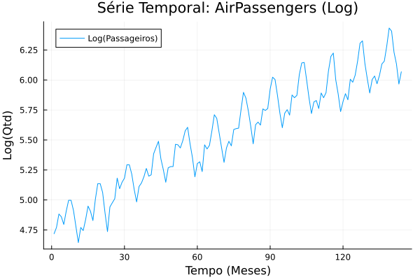
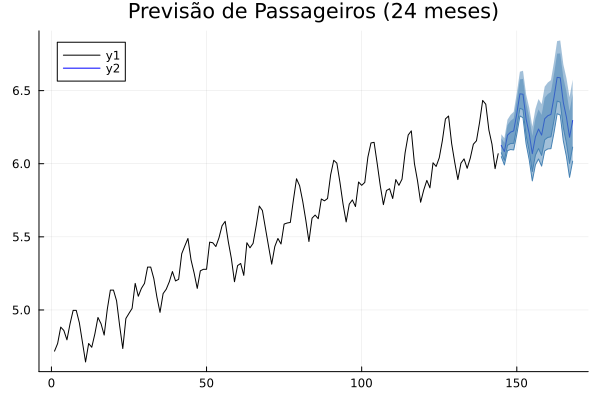
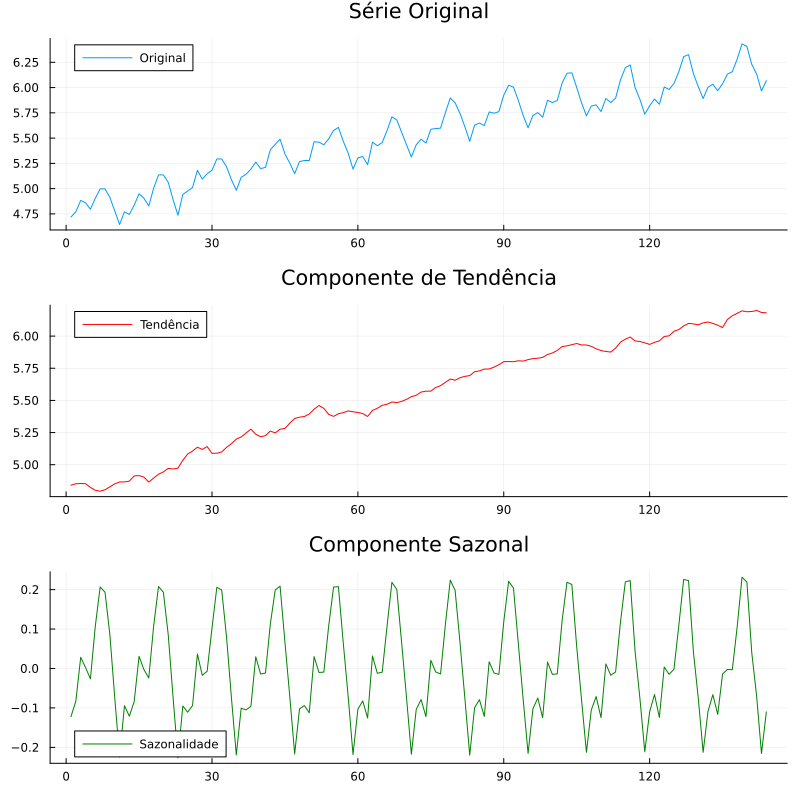
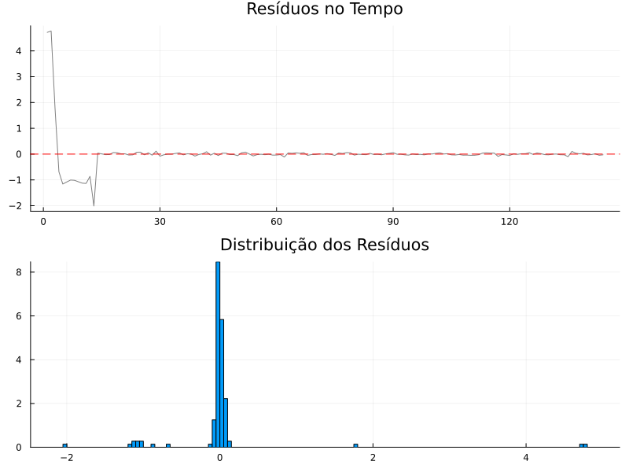

## Introdução

::: justify
Na análise de séries temporais, muitas vezes queremos mais do que apenas prever o próximo valor. Queremos entender **o que** compõe a série. A tendência está subindo? O padrão sazonal é estável? Existe um ciclo de longo prazo? e etc.

Modelos clássicos como o ARIMA focam na correlação entre valores passados. Já os **Modelos de Espaço de Estados (State Space Models)** focam na estrutura latente. Eles assumem que o que observamos é o resultado de componentes não observáveis (estados) que evoluem no tempo.

Em Julia, o pacote `StateSpaceModels.jl` fornece uma interface moderna e de alta performance para esses modelos. Ele utiliza o poderoso **Filtro de Kalman** para estimar componentes e realizar previsões.

Neste tutorial, vamos modelar o famoso dataset *AirPassengers* (número mensal de passageiros de linhas aéreas internacionais) para aprender a:

1.  Definir um modelo estrutural (Tendência + Sazonalidade).
2.  Ajustar os parâmetros via 'Máxima Verossimilhança'.
3.  Decompor a série em seus componentes.
4.  Realizar previsões para o futuro.
:::

## Instalação

::: justify
Precisaremos do pacote de modelagem, além de ferramentas para carregar dados (`CSV`, `DataFrames`) e plotar gráficos (`Plots`).
:::

```{julia}
using Pkg
Pkg.add([
    "StateSpaceModels", 
    "CSV", 
    "DataFrames", 
    "HTTP",         
    "Plots"
])
```

## Carregando e Preparando os Dados

::: justify 
Vamos baixar o dataset diretamente da web. Como a variância do número de passageiros aumenta com o tempo (heterocedasticidade), aplicaremos uma transformação logarítmica. Isso estabiliza a variância e torna a tendência mais linear, o que irá auxiliar o modelo. 
:::

```{julia}
#| output: false
# Carregando as bibliotecas necessárias
using StateSpaceModels
using CSV
using DataFrames
using HTTP
using Plots

# URL do dataset AirPassengers
url = "https://raw.githubusercontent.com/jbrownlee/Datasets/master/airline-passengers.csv"

# Usamos HTTP.get para baixar o conteúdo e IOBuffer para ler os dados baixados como se fossem um arquivo
resp = HTTP.get(url)
```
```{julia}
df = CSV.read(IOBuffer(resp.body), DataFrame)
```
```{julia}
#| output: false
# Acessando a coluna de dados e aplicando Log
# A coluna geralmente se chama "Passengers"
y_raw = Float64.(df[:, 2])
y = log.(y_raw)
# Visualização inicial
Plots.plot(y, label="Log(Passageiros)", title="Série Temporal: AirPassengers (Log)", 
     xlabel="Tempo (Meses)", ylabel="Log(Qtd)")
```



## O Modelo Estrutural Básico

::: justify
O StateSpaceModels.jl facilita muito a criação de modelos estruturais. Não precisamos escrever as matrizes do Filtro de Kalman manualmente.
Podemos usar a estrutura BasicStructural, que define a série $y_t$ como:

$$y_t = \mu_t + \gamma_t + \varepsilon_t$$
Onde:

-   $\mu_t$: É a Tendência Local (nível + inclinação).

-   $\gamma_t$: É a Sazonalidade (padrão que se repete).

-   $\varepsilon_t$: É o Ruído (erro de medição).

Como nossos dados são mensais, a sazonalidade é $s = 12$.
:::

```{julia}
#| output: false
# Definindo o modelo Estrutural Básico
# s = 12 indica sazonalidade de 12 períodos (anual/mensal)
model = BasicStructural(y, 12)

# Ajustando o modelo (encontrando as variâncias ótimas dos componentes)
fit!(model)
```
```{julia}
# Exibindo resumo do ajuste
print_results(model)
```

## Forecasting (Previsão)

::: justify
Com o modelo ajustado, prever o futuro é simples. Vamos projetar os próximos 24 meses (2 anos). O pacote calcula não apenas a previsão pontual, mas também os intervalos de confiança baseados na incerteza dos estados. 
:::

```{julia}
#| output: false
# Realiza a previsão para 24 passos à frente
steps = 24
forec = forecast(model, steps)

# Visualizando a previsão
# O gráfico automático do pacote já mostra dados históricos + previsão + intervalo
plot(model, forec, title="Previsão de Passageiros (24 meses)")
```



::: justify
O gráfico acima apresenta a linha preta, que representa os dados históricos observados da série temporal, e a linha azul, que corresponde às previsões realizadas pelo modelo para os 24 meses seguintes. A região sombreada em azul representa o intervalo de confiança das previsões, indicando a incerteza associada aos valores previstos. Observe que o modelo preserva o padrão sazonal da série, projetando a continuidade dos picos e das quedas ao longo do tempo.
:::

## O "Pulo do Gato": Decomposição

::: justify
A grande vantagem deste tipo de modelo sobre o ARIMA ou Redes Neurais é a interpretabilidade. Podemos pedir ao modelo para nos mostrar separadamente o que ele entende como "Tendência" e o que é "Sazonalidade". Isso é crucial para tomada de decisão: se as vendas caíram, foi culpa da sazonalidade (esperado) ou a tendência do negócio que está piorando (preocupante)? 
:::

```{julia}
# Obtendo os estados suavizados (smoothed states)
# Isso retorna a melhor estimativa dos componentes para cada ponto do passado
states = get_smoothed_state(model)
```
```{julia}
#| output: false
# O BasicStructural retorna os estados na ordem: [Tendência, Inclinação, Sazonalidade...]
trend = states[:, 1]
seasonal = states[:, 3] # O índice pode variar, mas geralmente o 3º inicia a sazonalidade
```
```{julia}
# Plotando a decomposição
p1 = plot(y, label="Original", title="Série Original")
p2 = plot(trend, label="Tendência", color=:red, title="Componente de Tendência")
p3 = plot(seasonal, label="Sazonalidade", color=:green, title="Componente Sazonal")
```
```{julia}
#| output: false
plot(p1, p2, p3, layout=(3,1), size=(800, 800))
```



::: justify 
Na figura acima:

-   Original: A série completa.

-   Tendência: Note como ela é suave e remove as oscilações anuais, mostrando o crescimento real do tráfego aéreo.

-   Sazonalidade: O padrão cíclico isolado, oscilando em torno de zero.
:::

## Diagnóstico do Modelo (Análise de Resíduos)

::: justify
Como saber se nosso modelo é bom? Na estatística, analisamos os **resíduos** (a diferença entre o que o modelo previu e o que realmente aconteceu).
Se o modelo capturou bem a estrutura dos dados (tendência e sazonalidade), os resíduos devem se comportar como um **Ruído Branco**, ou seja, deve apresentar as seguintes características:

1.  Média próxima de zero.
2.  Variância constante.
3.  Sem correlação temporal (aleatórios).
:::

```{julia}
#| output: false
# Obtendo as inovações (resíduos de predição um passo à frente)
residuos = get_innovations(model)
```
```{julia}
# Visualizando
# 1. Gráfico no tempo (deve parecer aleatório)
p1 = plot(residuos, title="Resíduos no Tempo", legend=false, color=:gray)
hline!(p1, [0], color=:red, linestyle=:dash)
# 2. Histograma (deve parecer uma Normal centrada no zero)
p2 = histogram(residuos, title="Distribuição dos Resíduos", legend=false, normalize=true)
```
```{julia}
#| output: false
# Plotando juntos
plot(p1, p2, layout=(2,1), size=(800, 600))
```



::: justify 
Análise de Diagnóstico: Os gráficos acima validam nosso modelo. Na parte superior, vemos os resíduos ao longo do tempo; a oscilação violenta no início (esquerda) representa o período em que o modelo estava "aprendendo" os estados iniciais. 

Após esse período, os resíduos se estabilizam em torno da linha vermelha (zero), sem padrões óbvios, o que indica que capturamos com sucesso a tendência e a sazonalidade. O histograma reforça isso, mostrando uma alta concentração de erros próximos a zero. 
:::

## Conclusão

::: justify
O StateSpaceModels.jl é uma ferramenta poderosa que traz a robustez dos Modelos de Espaço de Estados e do Filtro de Kalman para a análise de séries temporais em Julia. Ao longo deste tutorial, vimos que essa abordagem permite ir além da simples previsão, possibilitando compreender a estrutura da série por meio da decomposição em tendência e sazonalidade.

Entre suas principais vantagens estão:

- Previsões robustas: respeitando a dinâmica e a estrutura dos dados observados.
- Interpretabilidade: permitindo analisar separadamente componentes como tendência e sazonalidade, o que facilita a compreensão do comportamento da série.
- Flexibilidade: possibilitando trabalhar naturalmente com dados faltantes, graças ao Filtro de Kalman, além de realizar previsões e simular diferentes cenários.

Dominar Modelos de Espaço de Estados é um passo importante para quem deseja aprofundar seus conhecimentos em séries temporais. Além de fornecer uma base sólida para aplicações práticas, esses modelos servem de fundamento para técnicas mais avançadas, como modelos estruturais mais complexos, modelos dinâmicos bayesianos e diversas aplicações em econometria, finanças e ciência de dados.
:::

::: callout-note
Ferramentas de IA foram utilizadas para correção ortográfica e aprimoramento do texto. 
:::